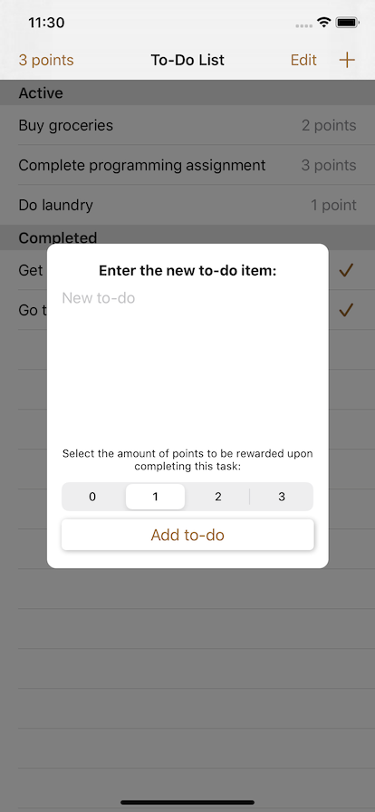
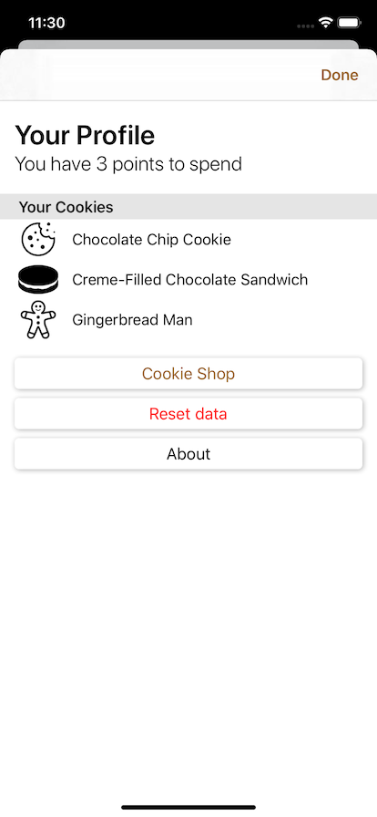
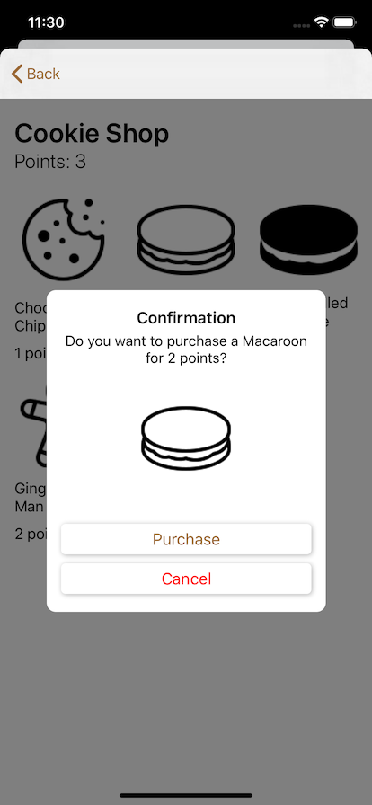
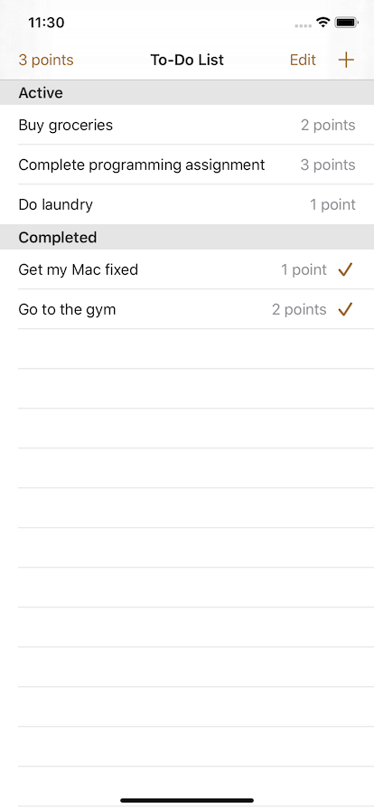

# Cookie Jar &nbsp;
An iOS to-do list app that offers a points-based reward system

## Screenshots

&nbsp;

&nbsp;

&nbsp;

## Key Takeaways
- MVVM Design Pattern
- Dependency Injection
- Creating views programmatically

## Acknowledgments
Icons from [Icons8](https://icons8.com/)
